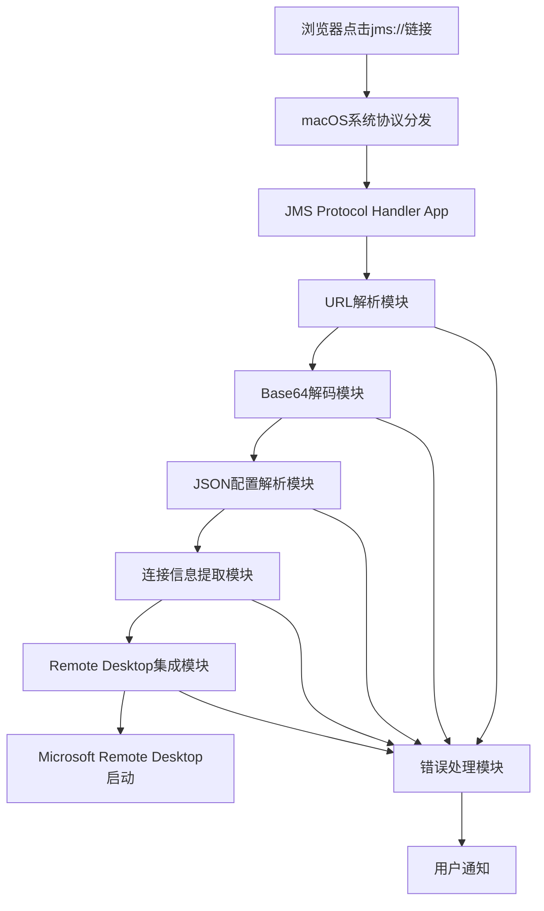

# Design Document

## Overview

本设计文档描述了一个macOS原生应用程序的实现方案，该程序用于处理jms://自定义协议URL，自动解码连接信息并启动Microsoft Remote Desktop进行远程连接。

基于macOS M4芯片的性能特点和系统架构，我们选择使用Swift和Cocoa框架开发原生macOS应用程序，以确保最佳的性能和系统集成度。

## Architecture

### 应用程序类型选择
- **主要应用类型**: macOS原生应用程序 (NSApplication)
- **开发语言**: Swift 5.0+
- **框架**: Cocoa, Foundation
- **部署方式**: 独立的.app包，通过Info.plist注册协议处理

### 系统架构图



## Components and Interfaces

### 1. 主应用程序控制器 (AppDelegate)
```swift
class AppDelegate: NSObject, NSApplicationDelegate {
    func application(_ application: NSApplication, open urls: [URL])
    func applicationDidFinishLaunching(_ aNotification: Notification)
}
```

**职责:**
- 处理系统传递的URL参数
- 管理应用程序生命周期
- 协调各个模块的工作流程

### 2. URL解析器 (URLParser)
```swift
protocol URLParserProtocol {
    func parseJMSURL(_ url: URL) throws -> JMSURLComponents
}

struct JMSURLComponents {
    let scheme: String
    let encodedPayload: String
}
```

**职责:**
- 验证URL格式是否为有效的jms://协议
- 提取base64编码的payload部分
- 进行基本的URL格式验证

### 3. 解码器 (PayloadDecoder)
```swift
protocol PayloadDecoderProtocol {
    func decodeBase64Payload(_ payload: String) throws -> Data
    func parseJSONConfig(_ data: Data) throws -> JMSConfig
}

struct JMSConfig {
    let filename: String
    let protocol: String
    let username: String
    let token: String
    let config: String
}
```

**职责:**
- 执行base64解码操作
- 解析JSON配置信息
- 数据格式验证和错误处理

### 4. 连接信息提取器 (ConnectionInfoExtractor)
```swift
protocol ConnectionInfoExtractorProtocol {
    func extractConnectionInfo(from config: JMSConfig) throws -> ConnectionInfo
}

struct ConnectionInfo {
    let fullAddress: String
    let username: String
    let additionalConfig: [String: String]
}
```

**职责:**
- 从config字符串中提取"full address:s:"后的值
- 从config字符串中提取"username:s:"后的值
- 解析其他RDP配置参数

### 5. Remote Desktop集成器 (RemoteDesktopIntegrator)
```swift
protocol RemoteDesktopIntegratorProtocol {
    func launchRemoteDesktop(with connectionInfo: ConnectionInfo) throws
    func checkRemoteDesktopAvailability() -> Bool
}
```

**职责:**
- 检查Microsoft Remote Desktop是否已安装
- 创建临时的RDP配置文件
- 启动Microsoft Remote Desktop并传递连接参数
- 处理应用程序启动失败的情况

### 6. 错误处理器 (ErrorHandler)
```swift
enum JMSError: LocalizedError {
    case invalidURL
    case decodingFailed
    case jsonParsingFailed
    case missingConnectionInfo
    case remoteDesktopNotFound
    case remoteDesktopLaunchFailed
}

protocol ErrorHandlerProtocol {
    func handleError(_ error: JMSError)
    func showUserNotification(_ message: String)
}
```

**职责:**
- 统一的错误处理和分类
- 用户友好的错误消息显示
- 系统通知管理

## Data Models

### JMSConfig数据模型
```swift
struct JMSConfig: Codable {
    let filename: String
    let protocol: String
    let username: String
    let token: String
    let config: String
    
    enum CodingKeys: String, CodingKey {
        case filename, protocol, username, token, config
    }
}
```

### ConnectionInfo数据模型
```swift
struct ConnectionInfo {
    let fullAddress: String      // "develop-jumpserver.jlcops.com:3389"
    let username: String         // "gongdewei|923dbe1e-874a-4512-8a9a-6e8f7744bf53"
    let sessionBpp: Int?         // 会话颜色深度
    let audioMode: Int?          // 音频模式
    let smartSizing: Bool?       // 智能调整大小
    let screenModeId: Int?       // 屏幕模式
    
    // 从config字符串解析的其他RDP参数
    let additionalConfig: [String: String]
}
```

### 配置文件解析规则
基于提供的示例，config字符串包含以下格式的参数：
- `full address:s:develop-jumpserver.jlcops.com:3389`
- `username:s:gongdewei|923dbe1e-874a-4512-8a9a-6e8f7744bf53`
- `session bpp:i:32`
- `audiomode:i:0`
- 其他RDP标准配置参数

## Error Handling

### 错误分类和处理策略

1. **URL格式错误**
   - 检查URL scheme是否为"jms"
   - 验证URL结构完整性
   - 显示用户友好的错误消息

2. **解码错误**
   - Base64解码失败处理
   - JSON格式验证
   - 数据完整性检查

3. **连接信息提取错误**
   - 必要字段缺失检测
   - 配置格式验证
   - 默认值处理

4. **Remote Desktop集成错误**
   - 应用程序可用性检查
   - 启动失败重试机制
   - 用户指导信息

### 用户通知机制
```swift
class NotificationManager {
    func showError(_ error: JMSError) {
        let notification = NSUserNotification()
        notification.title = "JMS Protocol Handler"
        notification.informativeText = error.localizedDescription
        notification.soundName = NSUserNotificationDefaultSoundName
        NSUserNotificationCenter.default.deliver(notification)
    }
}
```

## Testing Strategy

### 单元测试
- **URLParser测试**: 验证各种URL格式的解析正确性
- **PayloadDecoder测试**: 测试base64解码和JSON解析功能
- **ConnectionInfoExtractor测试**: 验证连接信息提取的准确性
- **ErrorHandler测试**: 确保错误处理的完整性

### 集成测试
- **端到端流程测试**: 从URL接收到Remote Desktop启动的完整流程
- **Microsoft Remote Desktop集成测试**: 验证与实际应用程序的交互
- **错误场景测试**: 测试各种异常情况的处理

### 性能测试
- **启动时间测试**: 确保应用程序在3秒内完成初始化
- **URL处理性能**: 验证1秒内完成解码和解析
- **内存使用测试**: 确保在M4芯片上的高效运行

### 兼容性测试
- **macOS版本兼容性**: 测试不同macOS版本的兼容性
- **Microsoft Remote Desktop版本**: 测试不同版本的Remote Desktop应用程序
- **M4芯片优化**: 验证在Apple Silicon上的性能表现

## Implementation Details

### 协议注册实现
通过Info.plist文件注册jms://协议处理：

```xml
<key>CFBundleURLTypes</key>
<array>
    <dict>
        <key>CFBundleURLName</key>
        <string>JMS Protocol</string>
        <key>CFBundleURLSchemes</key>
        <array>
            <string>jms</string>
        </array>
        <key>LSHandlerRank</key>
        <string>Owner</string>
    </dict>
</array>
```

### Microsoft Remote Desktop启动机制
使用NSWorkspace API启动外部应用程序：

```swift
func launchRemoteDesktop(with connectionInfo: ConnectionInfo) throws {
    // 创建临时RDP文件
    let rdpContent = generateRDPContent(from: connectionInfo)
    let tempURL = createTemporaryRDPFile(content: rdpContent)
    
    // 启动Microsoft Remote Desktop
    let workspace = NSWorkspace.shared
    try workspace.open(tempURL, withApplication: "Microsoft Remote Desktop")
}
```

### 配置文件生成
基于提取的连接信息生成标准的RDP配置文件格式，确保与Microsoft Remote Desktop完全兼容。