# Design Document

## Overview

本设计文档描述了一个macOS原生应用程序的实现方案，该程序用于处理jms://自定义协议URL，自动解码连接信息并根据协议类型启动相应的连接方式：
- **RDP协议**: 启动Microsoft Remote Desktop进行远程桌面连接
- **SSH协议**: 通过本地终端应用程序（Terminal或iTerm2）建立SSH会话连接

基于macOS M4芯片的性能特点和系统架构，我们选择使用Swift和Cocoa框架开发原生macOS应用程序，以确保最佳的性能和系统集成度。

## Architecture

### 应用程序类型选择
- **主要应用类型**: macOS原生应用程序 (NSApplication)
- **开发语言**: Swift 5.0+
- **框架**: Cocoa, Foundation
- **部署方式**: 独立的.app包，通过Info.plist注册协议处理

### 系统架构图

```mermaid
graph TD
    A[浏览器点击jms://链接] --> B[macOS系统协议分发]
    B --> C[JMS Protocol Handler App]
    C --> D[URL解析模块]
    D --> E[Base64解码模块]
    E --> F[JSON配置解析模块]
    F --> G[协议类型识别]
    
    G --> H{协议类型}
    H -->|RDP| I[RDP连接信息提取模块]
    H -->|SSH| J[SSH连接信息提取模块]
    
    I --> K[Remote Desktop集成模块]
    K --> L[Microsoft Remote Desktop启动]
    
    J --> M[SSH Token解析模块]
    M --> N[终端应用检测模块]
    N --> O[SSH命令构建模块]
    O --> P[终端启动模块]
    P --> Q[SSH会话建立]
    
    R[错误处理模块] --> S[用户通知]
    D --> R
    E --> R
    F --> R
    I --> R
    J --> R
    K --> R
    M --> R
    N --> R
    O --> R
    P --> R
```



## Components and Interfaces

### 1. 主应用程序控制器 (AppDelegate)
```swift
class AppDelegate: NSObject, NSApplicationDelegate {
    func application(_ application: NSApplication, open urls: [URL])
    func applicationDidFinishLaunching(_ aNotification: Notification)
}
```

**职责:**
- 处理系统传递的URL参数
- 管理应用程序生命周期
- 协调各个模块的工作流程

### 2. URL解析器 (URLParser)
```swift
protocol URLParserProtocol {
    func parseJMSURL(_ url: URL) throws -> JMSURLComponents
}

struct JMSURLComponents {
    let scheme: String
    let encodedPayload: String
}
```

**职责:**
- 验证URL格式是否为有效的jms://协议
- 提取base64编码的payload部分
- 进行基本的URL格式验证

### 3. 解码器 (PayloadDecoder)
```swift
protocol PayloadDecoderProtocol {
    func decodeBase64Payload(_ payload: String) throws -> Data
    func parseJSONConfig(_ data: Data) throws -> JMSConfig
}

struct JMSConfig {
    let filename: String
    let protocol: String    // "rdp" 或 "ssh"
    let username: String
    let token: String       // RDP时为空，SSH时包含JSON格式的连接信息
    let config: String      // RDP时包含配置信息，SSH时为空
}
```

**职责:**
- 执行base64解码操作
- 解析JSON配置信息
- 数据格式验证和错误处理

### 4. 连接信息提取器 (ConnectionInfoExtractor)
```swift
protocol ConnectionInfoExtractorProtocol {
    func extractConnectionInfo(from config: JMSConfig) throws -> ConnectionInfo
}

enum ConnectionInfo {
    case rdp(RDPConnectionInfo)
    case ssh(SSHConnectionInfo)
}

struct RDPConnectionInfo {
    let fullAddress: String
    let username: String
    let additionalConfig: [String: String]
}

struct SSHConnectionInfo {
    let ip: String
    let port: String
    let username: String
    let password: String
    let filename: String
}

// SSH Token 解析结构
struct SSHToken: Codable {
    let ip: String
    let port: String
    let username: String
    let password: String
}
```

**职责:**
- 从config字符串中提取"full address:s:"后的值
- 从config字符串中提取"username:s:"后的值
- 解析其他RDP配置参数

### 5. Remote Desktop集成器 (RemoteDesktopIntegrator)
```swift
protocol RemoteDesktopIntegratorProtocol {
    func launchRemoteDesktop(with connectionInfo: RDPConnectionInfo) throws
    func checkRemoteDesktopAvailability() -> Bool
    func generateOptimizedRDPConfig(for connectionInfo: RDPConnectionInfo) -> String
}
```

**职责:**
- 检查Microsoft Remote Desktop是否已安装
- 检测显示器配置并优化RDP参数
- 创建优化的RDP配置文件
- 启动Microsoft Remote Desktop并传递连接参数
- 处理应用程序启动失败的情况

### 5.1. 显示器检测器 (DisplayDetector)
```swift
protocol DisplayDetectorProtocol {
    func detectPrimaryDisplay() -> DisplayConfiguration
    func detectAllDisplays() -> [DisplayConfiguration]
    func isHiDPIDisplay() -> Bool
    func getOptimalRDPSettings() -> RDPDisplaySettings
}

struct DisplayConfiguration {
    let width: Int
    let height: Int
    let scaleFactor: CGFloat
    let colorDepth: Int
    let refreshRate: Int
    let isRetina: Bool
    let isExternal: Bool
}

struct RDPDisplaySettings {
    let desktopWidth: Int
    let desktopHeight: Int
    let sessionBpp: Int
    let desktopScaleFactor: Int
    let smartSizing: Bool
    let compression: Int
    let bitmapCachePersistEnable: Bool
    let disableWallpaper: Bool
    let allowFontSmoothing: Bool
    let screenModeId: Int
}
```

**职责:**
- 检测主显示器和所有显示器的配置信息
- 识别HiDPI（Retina）显示器
- 计算最优的RDP显示参数
- 支持多显示器环境的配置优化

### 6. SSH终端集成器 (SSHTerminalIntegrator)
```swift
protocol SSHTerminalIntegratorProtocol {
    func launchSSHSession(with connectionInfo: SSHConnectionInfo) throws
    func detectAvailableTerminal() -> TerminalApp
    func buildSSHCommand(from connectionInfo: SSHConnectionInfo) -> String
}

enum TerminalApp {
    case iterm2
    case terminal
    case unavailable
}
```

**职责:**
- 检测可用的终端应用程序（iTerm2优先，然后Terminal）
- 构建SSH连接命令，包含自动密码输入
- 通过AppleScript启动终端应用程序
- 执行SSH连接命令并建立会话
- 处理连接失败和超时情况

### 7. 错误处理器 (ErrorHandler)
```swift
enum JMSError: LocalizedError {
    case invalidURL
    case decodingFailed
    case jsonParsingFailed
    case missingConnectionInfo
    case unsupportedProtocol
    case remoteDesktopNotFound
    case remoteDesktopLaunchFailed
    case sshTokenParsingFailed
    case terminalNotAvailable
    case sshConnectionFailed
    case expectToolNotFound
    
    // 显示相关错误
    case displayDetectionFailed
    case unsupportedDisplayConfiguration
    case rdpConfigGenerationFailed
    case invalidDisplayParameters
    case hiDPIConfigurationFailed
}

protocol ErrorHandlerProtocol {
    func handleError(_ error: JMSError)
    func showUserNotification(_ message: String)
}
```

**职责:**
- 统一的错误处理和分类
- 用户友好的错误消息显示
- 系统通知管理

## Data Models

### JMSConfig数据模型
```swift
struct JMSConfig: Codable {
    let filename: String
    let protocol: String        // "rdp" 或 "ssh"
    let username: String
    let token: String          // SSH时包含JSON格式连接信息，RDP时为空
    let config: String         // RDP时包含配置信息，SSH时为空
    
    enum CodingKeys: String, CodingKey {
        case filename, protocol, username, token, config
    }
}
```

### ConnectionInfo数据模型
```swift
enum ConnectionInfo {
    case rdp(RDPConnectionInfo)
    case ssh(SSHConnectionInfo)
}

struct RDPConnectionInfo {
    let fullAddress: String      // "develop-jumpserver.jlcops.com:3389"
    let username: String         // "gongdewei|923dbe1e-874a-4512-8a9a-6e8f7744bf53"
    
    // 显示配置参数（基于显示器检测优化）
    let desktopWidth: Int?       // 桌面宽度
    let desktopHeight: Int?      // 桌面高度
    let sessionBpp: Int?         // 会话颜色深度 (16/24/32)
    let desktopScaleFactor: Int? // 桌面缩放因子 (100/125/150/200)
    
    // 显示质量参数
    let compression: Int?        // 压缩级别 (0=无压缩, 1=RDP6.0, 2=RDP6.1)
    let bitmapCachePersistEnable: Bool? // 位图缓存持久化
    let smartSizing: Bool?       // 智能调整大小
    let allowFontSmoothing: Bool? // 字体平滑
    
    // 音频和外设参数
    let audioMode: Int?          // 音频模式 (0=本地播放, 1=远程播放, 2=禁用)
    let disableWallpaper: Bool?  // 禁用壁纸
    let disableFullWindowDrag: Bool? // 禁用完整窗口拖拽
    let disableMenuAnims: Bool?  // 禁用菜单动画
    let disableThemes: Bool?     // 禁用主题
    
    // 屏幕和连接参数
    let screenModeId: Int?       // 屏幕模式 (1=窗口, 2=全屏)
    let connectionType: Int?     // 连接类型 (1=调制解调器, 2=低速宽带, 6=宽带)
    let networkAutoDetect: Bool? // 网络自动检测
    
    // 从config字符串解析的其他RDP参数
    let additionalConfig: [String: String]
}

struct SSHConnectionInfo {
    let ip: String              // "fat-jumpserver.jlc.com"
    let port: String            // "2222"
    let username: String        // "JMS-26307eea-9f95-4080-8381-3c62e9e407f2"
    let password: String        // "bfAMUXKl3ZaCpcxK"
    let filename: String        // "gongdewei-gn-repo-192_168_2_221-jumpserver"
}

// SSH Token 解析结构（从token字段解析）
struct SSHToken: Codable {
    let ip: String
    let port: String
    let username: String
    let password: String
}
```

### RDP配置文件解析规则
基于提供的示例，config字符串包含以下格式的参数：
- `full address:s:develop-jumpserver.jlcops.com:3389`
- `username:s:gongdewei|923dbe1e-874a-4512-8a9a-6e8f7744bf53`
- `session bpp:i:32`
- `audiomode:i:0`
- 其他RDP标准配置参数

## Error Handling

### 错误分类和处理策略

1. **URL格式错误**
   - 检查URL scheme是否为"jms"
   - 验证URL结构完整性
   - 显示用户友好的错误消息

2. **解码错误**
   - Base64解码失败处理
   - JSON格式验证
   - 数据完整性检查

3. **连接信息提取错误**
   - 必要字段缺失检测
   - 配置格式验证
   - 默认值处理

4. **Remote Desktop集成错误**
   - 应用程序可用性检查
   - 启动失败重试机制
   - 用户指导信息

### 用户通知机制
```swift
class NotificationManager {
    func showError(_ error: JMSError) {
        let notification = NSUserNotification()
        notification.title = "JMS Protocol Handler"
        notification.informativeText = error.localizedDescription
        notification.soundName = NSUserNotificationDefaultSoundName
        NSUserNotificationCenter.default.deliver(notification)
    }
}
```

## Testing Strategy

### 单元测试
- **URLParser测试**: 验证各种URL格式的解析正确性
- **PayloadDecoder测试**: 测试base64解码和JSON解析功能
- **ConnectionInfoExtractor测试**: 验证连接信息提取的准确性
- **ErrorHandler测试**: 确保错误处理的完整性

### 集成测试
- **端到端流程测试**: 从URL接收到Remote Desktop启动的完整流程
- **Microsoft Remote Desktop集成测试**: 验证与实际应用程序的交互
- **错误场景测试**: 测试各种异常情况的处理

### 性能测试
- **启动时间测试**: 确保应用程序在3秒内完成初始化
- **URL处理性能**: 验证1秒内完成解码和解析
- **内存使用测试**: 确保在M4芯片上的高效运行

### 兼容性测试
- **macOS版本兼容性**: 测试不同macOS版本的兼容性
- **Microsoft Remote Desktop版本**: 测试不同版本的Remote Desktop应用程序
- **M4芯片优化**: 验证在Apple Silicon上的性能表现

## Implementation Details

### 协议注册实现
通过Info.plist文件注册jms://协议处理：

```xml
<key>CFBundleURLTypes</key>
<array>
    <dict>
        <key>CFBundleURLName</key>
        <string>JMS Protocol</string>
        <key>CFBundleURLSchemes</key>
        <array>
            <string>jms</string>
        </array>
        <key>LSHandlerRank</key>
        <string>Owner</string>
    </dict>
</array>
```

### Microsoft Remote Desktop启动机制
使用NSWorkspace API启动外部应用程序，并集成显示器检测和配置优化：

```swift
func launchRemoteDesktop(with connectionInfo: RDPConnectionInfo) throws {
    // 检测显示器配置
    let displayDetector = DisplayDetector()
    let primaryDisplay = displayDetector.detectPrimaryDisplay()
    let rdpSettings = displayDetector.getOptimalRDPSettings()
    
    // 优化RDP配置
    let configOptimizer = RDPConfigOptimizer()
    let optimizedSettings = configOptimizer.optimizeForDisplay(primaryDisplay)
    
    // 生成优化的RDP配置内容
    let rdpContent = configOptimizer.generateRDPConfigString(optimizedSettings, connectionInfo: connectionInfo)
    let tempURL = createTemporaryRDPFile(content: rdpContent)
    
    // 启动Microsoft Remote Desktop
    let workspace = NSWorkspace.shared
    try workspace.open(tempURL, withApplication: "Microsoft Remote Desktop")
}

// 显示器检测实现
class DisplayDetector: DisplayDetectorProtocol {
    func detectPrimaryDisplay() -> DisplayConfiguration {
        guard let screen = NSScreen.main else {
            throw JMSError.displayDetectionFailed
        }
        
        let frame = screen.frame
        let scaleFactor = screen.backingScaleFactor
        let colorDepth = NSBitsPerPixelFromDepth(screen.depth)
        
        return DisplayConfiguration(
            width: Int(frame.width * scaleFactor),
            height: Int(frame.height * scaleFactor),
            scaleFactor: scaleFactor,
            colorDepth: colorDepth,
            refreshRate: 60, // 默认值，可通过Core Graphics API获取
            isRetina: scaleFactor > 1.0,
            isExternal: screen != NSScreen.main
        )
    }
    
    func detectAllDisplays() -> [DisplayConfiguration] {
        return NSScreen.screens.map { screen in
            let frame = screen.frame
            let scaleFactor = screen.backingScaleFactor
            let colorDepth = NSBitsPerPixelFromDepth(screen.depth)
            
            return DisplayConfiguration(
                width: Int(frame.width * scaleFactor),
                height: Int(frame.height * scaleFactor),
                scaleFactor: scaleFactor,
                colorDepth: colorDepth,
                refreshRate: 60,
                isRetina: scaleFactor > 1.0,
                isExternal: screen != NSScreen.main
            )
        }
    }
    
    func isHiDPIDisplay() -> Bool {
        return NSScreen.main?.backingScaleFactor ?? 1.0 > 1.0
    }
    
    func getOptimalRDPSettings() -> RDPDisplaySettings {
        let display = detectPrimaryDisplay()
        let optimizer = RDPConfigOptimizer()
        return optimizer.optimizeForDisplay(display)
    }
}

// RDP配置优化实现
class RDPConfigOptimizer: RDPConfigOptimizerProtocol {
    func optimizeForDisplay(_ display: DisplayConfiguration) -> RDPDisplaySettings {
        // 根据显示器特性计算最优设置
        let desktopWidth = min(display.width, 3840) // 限制最大4K分辨率
        let desktopHeight = min(display.height, 2160)
        
        // HiDPI显示器优化
        let desktopScaleFactor = display.isRetina ? Int(display.scaleFactor * 100) : 100
        let sessionBpp = display.colorDepth >= 32 ? 32 : 24
        
        // 质量优化设置
        let compression = display.isRetina ? 0 : 1 // Retina显示器使用无压缩
        let smartSizing = true // 启用智能调整
        let allowFontSmoothing = display.isRetina // Retina显示器启用字体平滑
        
        return RDPDisplaySettings(
            desktopWidth: desktopWidth,
            desktopHeight: desktopHeight,
            sessionBpp: sessionBpp,
            desktopScaleFactor: desktopScaleFactor,
            smartSizing: smartSizing,
            compression: compression,
            bitmapCachePersistEnable: true,
            disableWallpaper: false, // 保持完整桌面体验
            allowFontSmoothing: allowFontSmoothing,
            screenModeId: 2 // 全屏模式
        )
    }
    
    func generateRDPConfigString(_ settings: RDPDisplaySettings, connectionInfo: RDPConnectionInfo) -> String {
        var config = """
        full address:s:\(connectionInfo.fullAddress)
        username:s:\(connectionInfo.username)
        desktopwidth:i:\(settings.desktopWidth)
        desktopheight:i:\(settings.desktopHeight)
        session bpp:i:\(settings.sessionBpp)
        desktopscalefactor:i:\(settings.desktopScaleFactor)
        smart sizing:i:\(settings.smartSizing ? 1 : 0)
        compression:i:\(settings.compression)
        bitmapcachepersistenable:i:\(settings.bitmapCachePersistEnable ? 1 : 0)
        disable wallpaper:i:\(settings.disableWallpaper ? 1 : 0)
        allow font smoothing:i:\(settings.allowFontSmoothing ? 1 : 0)
        screen mode id:i:\(settings.screenModeId)
        """
        
        // 添加其他配置参数
        for (key, value) in connectionInfo.additionalConfig {
            config += "\n\(key):\(value)"
        }
        
        return config
    }
}
```

### SSH终端启动机制
使用AppleScript和expect工具实现自动SSH连接：

```swift
func launchSSHSession(with connectionInfo: SSHConnectionInfo) throws {
    let terminalApp = detectAvailableTerminal()
    let sshCommand = buildSSHCommand(from: connectionInfo)
    
    switch terminalApp {
    case .iterm2:
        try launchITerm2WithSSH(command: sshCommand)
    case .terminal:
        try launchTerminalWithSSH(command: sshCommand)
    case .unavailable:
        throw JMSError.terminalNotAvailable
    }
}

private func buildSSHCommand(from connectionInfo: SSHConnectionInfo) -> String {
    // 使用expect脚本自动输入密码
    let expectScript = """
    expect -c "
    spawn ssh -p \(connectionInfo.port) \(connectionInfo.username)@\(connectionInfo.ip)
    expect \\"password:\\"
    send \\"\(connectionInfo.password)\\r\\"
    interact
    "
    """
    return expectScript
}

private func launchITerm2WithSSH(command: String) throws {
    let appleScript = """
    tell application "iTerm"
        create window with default profile
        tell current session of current window
            write text "\(command)"
        end tell
    end tell
    """
    
    var error: NSDictionary?
    if let scriptObject = NSAppleScript(source: appleScript) {
        scriptObject.executeAndReturnError(&error)
        if let error = error {
            throw JMSError.sshConnectionFailed
        }
    }
}

private func launchTerminalWithSSH(command: String) throws {
    let appleScript = """
    tell application "Terminal"
        activate
        do script "\(command)"
    end tell
    """
    
    var error: NSDictionary?
    if let scriptObject = NSAppleScript(source: appleScript) {
        scriptObject.executeAndReturnError(&error)
        if let error = error {
            throw JMSError.sshConnectionFailed
        }
    }
}
```

### 终端应用程序检测
```swift
func detectAvailableTerminal() -> TerminalApp {
    let workspace = NSWorkspace.shared
    
    // 优先检测 iTerm2
    if let _ = workspace.urlForApplication(withBundleIdentifier: "com.googlecode.iterm2") {
        return .iterm2
    }
    
    // 检测系统默认 Terminal
    if let _ = workspace.urlForApplication(withBundleIdentifier: "com.apple.Terminal") {
        return .terminal
    }
    
    return .unavailable
}
```

### 质量配置界面实现 🆕
使用Cocoa框架创建原生macOS配置界面：

```swift
class ConfigurationWindowController: NSWindowController {
    override func windowDidLoad() {
        super.windowDidLoad()
        setupQualityConfigurationUI()
        loadCurrentConfiguration()
    }
    
    private func setupQualityConfigurationUI() {
        // 创建质量配置选项卡
        let tabView = NSTabView()
        
        // 预设配置选项卡
        let presetTab = NSTabViewItem(identifier: "presets")
        presetTab.label = "预设配置"
        presetTab.view = createPresetConfigurationView()
        tabView.addTabViewItem(presetTab)
        
        // 自定义配置选项卡
        let customTab = NSTabViewItem(identifier: "custom")
        customTab.label = "自定义配置"
        customTab.view = createCustomConfigurationView()
        tabView.addTabViewItem(customTab)
        
        // 高级设置选项卡
        let advancedTab = NSTabViewItem(identifier: "advanced")
        advancedTab.label = "高级设置"
        advancedTab.view = createAdvancedConfigurationView()
        tabView.addTabViewItem(advancedTab)
        
        window?.contentView = tabView
    }
    
    private func createPresetConfigurationView() -> NSView {
        let view = NSView()
        
        // 质量配置文件选择
        let profileMatrix = NSMatrix(frame: NSRect(x: 20, y: 200, width: 400, height: 120))
        profileMatrix.mode = .radioMode
        profileMatrix.addRow()
        profileMatrix.cells[0].title = "性能优先 - 适合低带宽网络环境"
        profileMatrix.addRow()
        profileMatrix.cells[1].title = "平衡模式 - 性能与质量的最佳平衡"
        profileMatrix.addRow()
        profileMatrix.cells[2].title = "质量优先 - 适合高带宽局域网环境"
        
        // 配置说明标签
        let descriptionLabel = NSTextField(labelWithString: "选择适合您网络环境的质量配置文件")
        descriptionLabel.frame = NSRect(x: 20, y: 160, width: 400, height: 20)
        
        // 预估信息显示
        let infoView = createConfigurationInfoView()
        infoView.frame = NSRect(x: 20, y: 20, width: 400, height: 120)
        
        view.addSubview(profileMatrix)
        view.addSubview(descriptionLabel)
        view.addSubview(infoView)
        
        return view
    }
    
    private func createCustomConfigurationView() -> NSView {
        let view = NSView()
        
        // 压缩级别滑块
        let compressionLabel = NSTextField(labelWithString: "压缩级别:")
        compressionLabel.frame = NSRect(x: 20, y: 280, width: 100, height: 20)
        
        let compressionSlider = NSSlider(frame: NSRect(x: 130, y: 280, width: 200, height: 20))
        compressionSlider.minValue = 0
        compressionSlider.maxValue = 2
        compressionSlider.numberOfTickMarks = 3
        compressionSlider.allowsTickMarkValuesOnly = true
        
        // 颜色深度选择
        let colorDepthLabel = NSTextField(labelWithString: "颜色深度:")
        colorDepthLabel.frame = NSRect(x: 20, y: 240, width: 100, height: 20)
        
        let colorDepthPopup = NSPopUpButton(frame: NSRect(x: 130, y: 240, width: 100, height: 20))
        colorDepthPopup.addItems(withTitles: ["16位", "24位", "32位"])
        
        // 特效选项复选框
        let fontSmoothingCheckbox = NSButton(checkboxWithTitle: "启用字体平滑", target: nil, action: nil)
        fontSmoothingCheckbox.frame = NSRect(x: 20, y: 200, width: 150, height: 20)
        
        let wallpaperCheckbox = NSButton(checkboxWithTitle: "显示桌面壁纸", target: nil, action: nil)
        wallpaperCheckbox.frame = NSRect(x: 20, y: 170, width: 150, height: 20)
        
        let animationsCheckbox = NSButton(checkboxWithTitle: "启用菜单动画", target: nil, action: nil)
        animationsCheckbox.frame = NSRect(x: 20, y: 140, width: 150, height: 20)
        
        // 音频质量选择
        let audioLabel = NSTextField(labelWithString: "音频质量:")
        audioLabel.frame = NSRect(x: 200, y: 200, width: 80, height: 20)
        
        let audioPopup = NSPopUpButton(frame: NSRect(x: 290, y: 200, width: 100, height: 20))
        audioPopup.addItems(withTitles: ["禁用", "低质量", "中等", "高质量"])
        
        // 实时预览区域
        let previewLabel = NSTextField(labelWithString: "配置预览:")
        previewLabel.frame = NSRect(x: 20, y: 100, width: 100, height: 20)
        
        let previewTextView = NSTextView(frame: NSRect(x: 20, y: 20, width: 400, height: 70))
        previewTextView.isEditable = false
        previewTextView.backgroundColor = NSColor.controlBackgroundColor
        
        view.addSubview(compressionLabel)
        view.addSubview(compressionSlider)
        view.addSubview(colorDepthLabel)
        view.addSubview(colorDepthPopup)
        view.addSubview(fontSmoothingCheckbox)
        view.addSubview(wallpaperCheckbox)
        view.addSubview(animationsCheckbox)
        view.addSubview(audioLabel)
        view.addSubview(audioPopup)
        view.addSubview(previewLabel)
        view.addSubview(previewTextView)
        
        return view
    }
    
    private func createConfigurationInfoView() -> NSView {
        let view = NSView()
        view.wantsLayer = true
        view.layer?.backgroundColor = NSColor.controlBackgroundColor.cgColor
        view.layer?.cornerRadius = 8
        
        let bandwidthLabel = NSTextField(labelWithString: "预估带宽需求: 1-3 Mbps")
        bandwidthLabel.frame = NSRect(x: 10, y: 80, width: 200, height: 20)
        
        let performanceLabel = NSTextField(labelWithString: "性能影响: 中等")
        performanceLabel.frame = NSRect(x: 10, y: 50, width: 200, height: 20)
        
        let qualityLabel = NSTextField(labelWithString: "显示质量: 标准")
        qualityLabel.frame = NSRect(x: 10, y: 20, width: 200, height: 20)
        
        view.addSubview(bandwidthLabel)
        view.addSubview(performanceLabel)
        view.addSubview(qualityLabel)
        
        return view
    }
}

// 配置应用和集成
extension RemoteDesktopIntegrator {
    func launchRemoteDesktopWithQualityConfig(connectionInfo: RDPConnectionInfo) throws {
        // 获取当前质量配置
        let configManager = QualityConfigurationManager()
        let currentProfile = configManager.getCurrentProfile()
        let qualitySettings = configManager.getQualitySettings(for: currentProfile)
        
        // 检测显示器配置
        let displayDetector = DisplayDetector()
        let primaryDisplay = displayDetector.detectPrimaryDisplay()
        
        // 合并质量配置和显示器优化
        let optimizedSettings = mergeQualityAndDisplaySettings(
            qualitySettings: qualitySettings,
            displayConfig: primaryDisplay
        )
        
        // 生成最终RDP配置
        let rdpContent = generateOptimizedRDPConfig(
            settings: optimizedSettings,
            connectionInfo: connectionInfo
        )
        
        let tempURL = createTemporaryRDPFile(content: rdpContent)
        
        // 启动Microsoft Remote Desktop
        let workspace = NSWorkspace.shared
        try workspace.open(tempURL, withApplication: "Microsoft Remote Desktop")
    }
    
    private func mergeQualityAndDisplaySettings(
        qualitySettings: RDPQualitySettings,
        displayConfig: DisplayConfiguration
    ) -> RDPDisplaySettings {
        // 将用户质量偏好与显示器优化相结合
        return RDPDisplaySettings(
            desktopWidth: min(displayConfig.width, 3840),
            desktopHeight: min(displayConfig.height, 2160),
            sessionBpp: qualitySettings.colorDepth,
            desktopScaleFactor: Int(displayConfig.scaleFactor * 100),
            smartSizing: true,
            compression: qualitySettings.compressionLevel,
            bitmapCachePersistEnable: qualitySettings.bitmapCaching,
            disableWallpaper: !qualitySettings.enableWallpaper,
            allowFontSmoothing: qualitySettings.enableFontSmoothing && displayConfig.isRetina,
            screenModeId: 2
        )
    }
}
```

### 菜单栏集成 🆕
在应用程序菜单栏中添加质量配置入口：

```swift
extension AppDelegate {
    func setupMenuBar() {
        let mainMenu = NSMenu()
        
        // 应用程序菜单
        let appMenuItem = NSMenuItem()
        let appMenu = NSMenu()
        
        // 添加质量配置菜单项
        let configMenuItem = NSMenuItem(
            title: "RDP质量配置...",
            action: #selector(showQualityConfiguration),
            keyEquivalent: ","
        )
        configMenuItem.keyEquivalentModifierMask = .command
        appMenu.addItem(configMenuItem)
        
        appMenu.addItem(NSMenuItem.separator())
        
        // 快速切换质量配置子菜单
        let quickSwitchMenuItem = NSMenuItem(title: "快速切换质量", action: nil, keyEquivalent: "")
        let quickSwitchMenu = NSMenu()
        
        quickSwitchMenu.addItem(NSMenuItem(
            title: "性能优先",
            action: #selector(switchToPerformanceMode),
            keyEquivalent: "1"
        ))
        quickSwitchMenu.addItem(NSMenuItem(
            title: "平衡模式",
            action: #selector(switchToBalancedMode),
            keyEquivalent: "2"
        ))
        quickSwitchMenu.addItem(NSMenuItem(
            title: "质量优先",
            action: #selector(switchToQualityMode),
            keyEquivalent: "3"
        ))
        
        quickSwitchMenuItem.submenu = quickSwitchMenu
        appMenu.addItem(quickSwitchMenuItem)
        
        appMenuItem.submenu = appMenu
        mainMenu.addItem(appMenuItem)
        
        NSApplication.shared.mainMenu = mainMenu
    }
    
    @objc func showQualityConfiguration() {
        let configController = ConfigurationWindowController()
        configController.showWindow(nil)
    }
    
    @objc func switchToPerformanceMode() {
        let configManager = QualityConfigurationManager()
        configManager.setCurrentProfile(.performance)
        showNotification("已切换到性能优先模式")
    }
    
    @objc func switchToBalancedMode() {
        let configManager = QualityConfigurationManager()
        configManager.setCurrentProfile(.balanced)
        showNotification("已切换到平衡模式")
    }
    
    @objc func switchToQualityMode() {
        let configManager = QualityConfigurationManager()
        configManager.setCurrentProfile(.quality)
        showNotification("已切换到质量优先模式")
    }
    
    private func showNotification(_ message: String) {
        let notification = NSUserNotification()
        notification.title = "JMS Protocol Handler"
        notification.informativeText = message
        NSUserNotificationCenter.default.deliver(notification)
    }
}
```