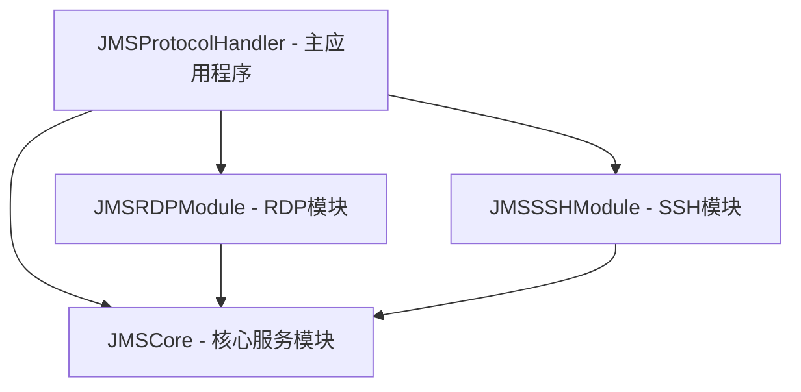

# JMS Protocol Handler 模块划分和依赖关系

## 模块架构概览

基于需求分析和设计文档，JMS Protocol Handler 采用分层模块化架构，将功能按职责划分为以下核心模块：



## 模块详细定义

### 1. JMSCore - 核心服务模块 (合并后)

**职责：**
- 定义核心数据模型
- 实现基础服务功能：URL解析、数据解码、错误处理
- 提供通用工具和系统集成服务

**主要组件：**
- **数据模型 (Models/)**
  - `JMSError.swift` - 统一错误类型定义
  - `ConnectionInfo.swift` - 连接信息枚举和结构体
  - `JMSURLComponents.swift` - URL组件结构
  - `JMSConfig.swift` - 配置信息结构
  - `DisplayConfiguration.swift` - 显示器配置结构

- **服务实现 (Services/)**
  - `URLParser.swift` - URL解析服务
  - `PayloadDecoder.swift` - Base64解码和JSON解析
  - `ConnectionInfoExtractor.swift` - 连接信息提取
  - `ErrorHandler.swift` - 统一错误处理
  - `NotificationManager.swift` - 用户通知管理

**依赖关系：**
- 无外部依赖（基础模块）
- 依赖系统框架：Foundation, CoreGraphics, Cocoa

**导出接口：**
```swift
// 核心数据类型
public enum JMSError: LocalizedError
public enum ConnectionInfo
public struct RDPConnectionInfo
public struct SSHConnectionInfo
public struct JMSURLComponents
public struct JMSConfig
public struct DisplayConfiguration

// 服务实现类 (直接实现，无需协议抽象)
public class URLParser
public class ConnectionInfoExtractor
public class ErrorHandler
public class PayloadDecoder
public class NotificationManager
```

### 2. JMSRDPModule - RDP模块

**职责：**
- 处理RDP协议相关功能
- 实现显示器检测和RDP配置管理
- 管理RDP用户界面和高级设置
- 集成Microsoft Remote Desktop

**主要组件：**
- **RDP设置 (RDPSettings/)**
  - `RDPSettingsModel.swift` - RDP设置数据模型
  - `RDPSettingsViewController.swift` - RDP设置界面控制器
  - `RDPDisplayConfigurationView.swift` - 分辨率和HiDPI配置界面 🆕
  - `RDPAdvancedOptionsView.swift` - 高级显示选项界面 🆕
  - `RDPConfigurationTemplateManager.swift` - 配置模板管理器 🆕

- **显示配置管理 (DisplayConfiguration/)**
  - `DisplayResolutionManager.swift` - 分辨率管理器 🆕
  - `HiDPIConfigurationManager.swift` - HiDPI配置管理器 🆕
  - `DisplayPreviewGenerator.swift` - 显示配置预览生成器 🆕
  - `DisplayCompatibilityValidator.swift` - 显示兼容性验证器 🆕

- **配置导入导出 (ConfigurationIO/)**
  - `RDPConfigurationExporter.swift` - RDP配置导出器 🆕
  - `RDPConfigurationImporter.swift` - RDP配置导入器 🆕
  - `ConfigurationTemplateStorage.swift` - 配置模板存储管理 🆕

- **服务实现 (Services/)**
  - `RemoteDesktopIntegrator.swift` - Remote Desktop集成
  - `DisplayDetector.swift` - 显示器检测实现
  - `RDPConfigManager.swift` - RDP配置管理器（合并优化和质量管理功能）

**依赖关系：**
- 依赖：JMSCore
- 依赖系统框架：Foundation, Cocoa, CoreGraphics

**导出接口：**
```swift
public class RemoteDesktopIntegrator
public class DisplayDetector
public class RDPConfigManager  // 统一的配置管理器
public class RDPSettingsViewController

// 新增的显示配置相关接口 🆕
public class RDPDisplayConfigurationView
public class RDPAdvancedOptionsView
public class DisplayResolutionManager
public class HiDPIConfigurationManager
public class DisplayPreviewGenerator
public class RDPConfigurationTemplateManager
public class RDPConfigurationExporter
public class RDPConfigurationImporter
```

### 3. JMSSSHModule - SSH模块

**职责：**
- 处理SSH协议相关功能
- 管理终端应用程序集成
- 实现自动密码输入和会话管理

**主要组件：**
- `SSHTerminalIntegrator.swift` - SSH终端集成实现

**依赖关系：**
- 依赖：JMSCore
- 依赖系统框架：Foundation, Cocoa

**导出接口：**
```swift
public class SSHTerminalIntegrator
```

### 5. JMSGUIValidation - GUI验证工具模块

**职责：**
- 提供通用的GUI自动化验证工具
- 生成界面组件层级树
- 提供界面元素检查和验证功能
- 作为基础工具被其他模块使用

**主要组件：**
- `UIComponentTreeGenerator.swift` - UI组件树生成器
- `GUIElementValidator.swift` - GUI元素验证器
- `ValidationReportGenerator.swift` - 验证报告生成器
- `ComponentHierarchyAnalyzer.swift` - 组件层级分析器

**依赖关系：**
- 依赖：JMSCore（仅用于基础数据类型）
- 依赖系统框架：Foundation, Cocoa
- **注意：这是基础工具模块，不依赖业务功能模块**

**导出接口：**
```swift
public class UIComponentTreeGenerator
public class GUIElementValidator
public class ValidationReportGenerator
public class ComponentHierarchyAnalyzer
```

### 4. JMSProtocolHandler - 主应用程序

**职责：**
- 应用程序入口和生命周期管理
- 协调各模块间的工作流程
- 处理系统协议调用
- 管理用户界面和菜单

**主要组件：**
- `main.swift` - 应用程序入口
- `AppDelegate.swift` - 应用程序委托
- `Resources/` - 资源文件（Info.plist, Assets, XIB等）

**依赖关系：**
- 依赖：JMSCore, JMSRDPModule, JMSSSHModule
- 依赖系统框架：Foundation, Cocoa
