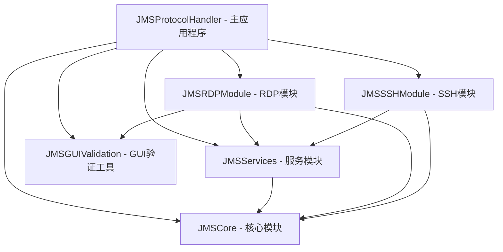

# JMS Protocol Handler 模块划分和依赖关系

## 模块架构概览

基于需求分析和设计文档，JMS Protocol Handler 采用分层模块化架构，将功能按职责划分为以下核心模块：



## 模块详细定义

### 1. JMSCore - 核心模块

**职责：**
- 定义核心数据模型
- 提供基础错误处理
- 定义关键业务协议（仅限核心抽象）

**主要组件：**
- **数据模型 (Models/)**
  - `JMSError.swift` - 统一错误类型定义
  - `ConnectionInfo.swift` - 连接信息枚举和结构体
  - `JMSURLComponents.swift` - URL组件结构
  - `JMSConfig.swift` - 配置信息结构
  - `DisplayConfiguration.swift` - 显示器配置结构

- **核心协议 (Protocols/)** - 仅保留必要的抽象
  - `URLParserProtocol.swift` - URL解析协议
  - `ConnectionInfoExtractorProtocol.swift` - 连接信息提取协议
  - `ErrorHandlerProtocol.swift` - 错误处理协议

**依赖关系：**
- 无外部依赖（基础模块）
- 依赖系统框架：Foundation, CoreGraphics

**导出接口：**
```swift
// 核心数据类型
public enum JMSError: LocalizedError
public enum ConnectionInfo
public struct RDPConnectionInfo
public struct SSHConnectionInfo
public struct JMSURLComponents
public struct JMSConfig
public struct DisplayConfiguration

// 核心协议（仅必要抽象）
public protocol URLParserProtocol
public protocol ConnectionInfoExtractorProtocol
public protocol ErrorHandlerProtocol
```

### 2. JMSServices - 服务模块

**职责：**
- 实现通用服务功能
- 提供URL解析、数据解码、错误处理等基础服务
- 管理用户通知和系统集成

**主要组件：**
- `URLParser.swift` - URL解析实现
- `PayloadDecoder.swift` - Base64解码和JSON解析
- `ConnectionInfoExtractor.swift` - 连接信息提取
- `ErrorHandler.swift` - 统一错误处理
- `NotificationManager.swift` - 用户通知管理

**依赖关系：**
- 依赖：JMSCore
- 依赖系统框架：Foundation, Cocoa

**导出接口：**
```swift
public class URLParser: URLParserProtocol
public class ConnectionInfoExtractor: ConnectionInfoExtractorProtocol
public class ErrorHandler: ErrorHandlerProtocol
public class PayloadDecoder
public class NotificationManager
```

### 3. JMSRDPModule - RDP模块

**职责：**
- 处理RDP协议相关功能
- 实现显示器检测和配置优化（直接实现，无需协议抽象）
- 管理RDP质量配置和用户界面
- 集成Microsoft Remote Desktop

**主要组件：**
- **RDP设置 (RDPSettings/)**
  - `RDPSettingsModel.swift` - RDP设置数据模型
  - `RDPSettingsManager.swift` - RDP设置管理器
  - `RDPSettingsViewController.swift` - RDP设置界面控制器

- **服务实现 (Services/)**
  - `RemoteDesktopIntegrator.swift` - Remote Desktop集成
  - `DisplayDetector.swift` - 显示器检测实现
  - `RDPConfigOptimizer.swift` - RDP配置优化器（直接实现类）
  - `RDPQualityConfigManager.swift` - RDP质量配置管理
  - `RDPQualityConfigViewController.swift` - 质量配置界面

**依赖关系：**
- 依赖：JMSCore, JMSServices, JMSGUIValidation（用于界面验证）
- 依赖系统框架：Foundation, Cocoa, CoreGraphics

**导出接口：**
```swift
public class RemoteDesktopIntegrator
public class DisplayDetector
public class RDPConfigOptimizer  // 直接实现类，无需协议
public class RDPSettingsManager
public class RDPSettingsViewController
public class RDPQualityConfigManager
```

### 4. JMSSSHModule - SSH模块

**职责：**
- 处理SSH协议相关功能
- 管理终端应用程序集成
- 实现自动密码输入和会话管理

**主要组件：**
- `SSHTerminalIntegrator.swift` - SSH终端集成实现

**依赖关系：**
- 依赖：JMSCore, JMSServices
- 依赖系统框架：Foundation, Cocoa

**导出接口：**
```swift
public class SSHTerminalIntegrator
```

### 5. JMSGUIValidation - GUI验证工具模块

**职责：**
- 提供通用的GUI自动化验证工具
- 生成界面组件层级树
- 提供界面元素检查和验证功能
- 作为基础工具被其他模块使用

**主要组件：**
- `UIComponentTreeGenerator.swift` - UI组件树生成器
- `GUIElementValidator.swift` - GUI元素验证器
- `ValidationReportGenerator.swift` - 验证报告生成器
- `ComponentHierarchyAnalyzer.swift` - 组件层级分析器

**依赖关系：**
- 依赖：JMSCore（仅用于基础数据类型）
- 依赖系统框架：Foundation, Cocoa
- **注意：这是基础工具模块，不依赖业务功能模块**

**导出接口：**
```swift
public class UIComponentTreeGenerator
public class GUIElementValidator
public class ValidationReportGenerator
public class ComponentHierarchyAnalyzer
```

### 6. JMSProtocolHandler - 主应用程序

**职责：**
- 应用程序入口和生命周期管理
- 协调各模块间的工作流程
- 处理系统协议调用
- 管理用户界面和菜单

**主要组件：**
- `main.swift` - 应用程序入口
- `AppDelegate.swift` - 应用程序委托
- `Resources/` - 资源文件（Info.plist, Assets, XIB等）

**依赖关系：**
- 依赖：JMSCore, JMSServices, JMSRDPModule, JMSSSHModule
- 依赖系统框架：Foundation, Cocoa

## 设计调整说明

### 1. GUI验证模块重新定位
- **调整前**：GUI验证模块依赖RDP模块
- **调整后**：GUI验证作为基础工具模块，RDP模块在需要时使用GUI验证工具
- **优势**：GUI验证工具可以被任何需要界面验证的模块使用，提高复用性

### 2. Core模块精简
- **调整前**：Core模块包含大量协议定义
- **调整后**：仅保留核心数据模型和必要的抽象协议
- **移除的协议**：
  - `PayloadDecoderProtocol` - 解码功能相对简单，直接实现即可
  - `NotificationManagerProtocol` - 通知管理功能稳定，无需抽象
  - `DisplayDetectorProtocol` - 显示器检测是具体实现，无需协议
  - `RDPConfigOptimizerProtocol` - RDP配置优化是具体业务逻辑，无需抽象
  - `RemoteDesktopIntegratorProtocol` - 与外部应用集成，具体实现更合适
  - `SSHTerminalIntegratorProtocol` - SSH集成是具体实现
  - `RDPQualityConfigManagerProtocol` - 质量配置管理是具体业务
  - `ConfigurationViewControllerProtocol` - UI控制器无需协议抽象

### 3. 保留的核心协议及理由
- `URLParserProtocol` - URL解析可能有多种实现方式，需要抽象
- `ConnectionInfoExtractorProtocol` - 连接信息提取逻辑可能扩展，需要抽象
- `ErrorHandlerProtocol` - 错误处理策略可能变化，需要抽象

## 模块间通信机制

### 1. 简化的依赖关系
```
JMSProtocolHandler
├── JMSCore (基础数据和核心协议)
├── JMSServices (通用服务实现)
├── JMSRDPModule (RDP业务逻辑)
│   └── 使用 JMSGUIValidation (界面验证)
└── JMSSSHModule (SSH业务逻辑)
```

### 2. 数据流向
```
URL输入 → JMSServices(解析) → JMSCore(数据模型) → 
RDP: JMSRDPModule(处理) → Microsoft Remote Desktop
SSH: JMSSSHModule(处理) → Terminal/iTerm2
```

### 3. GUI验证使用流程
```
RDPQualityConfigViewController → JMSGUIValidation(验证工具) → 验证报告
```

## 模块构建顺序

基于调整后的依赖关系：

1. **JMSCore** - 基础模块，无依赖
2. **JMSGUIValidation** - 基础工具模块，仅依赖JMSCore
3. **JMSServices** - 依赖JMSCore
4. **JMSRDPModule** - 依赖JMSCore、JMSServices、JMSGUIValidation
5. **JMSSSHModule** - 依赖JMSCore、JMSServices
6. **JMSProtocolHandler** - 主应用程序，依赖所有模块

## 优化后的优势

### 1. 更清晰的职责分离
- Core模块专注于核心数据和必要抽象
- GUI验证作为独立工具，可复用性更强
- 业务模块专注于具体实现，减少过度抽象

### 2. 更好的可维护性
- 减少不必要的协议层，降低复杂度
- GUI验证工具独立，便于测试和维护
- 依赖关系更加清晰和合理

### 3. 更高的开发效率
- 避免过度设计，专注于实际需求
- 模块间耦合度降低，并行开发更容易
- 测试策略更加直接和有效

这种调整后的模块划分更符合实际开发需求，避免了过度抽象，同时保持了良好的模块化设计。
