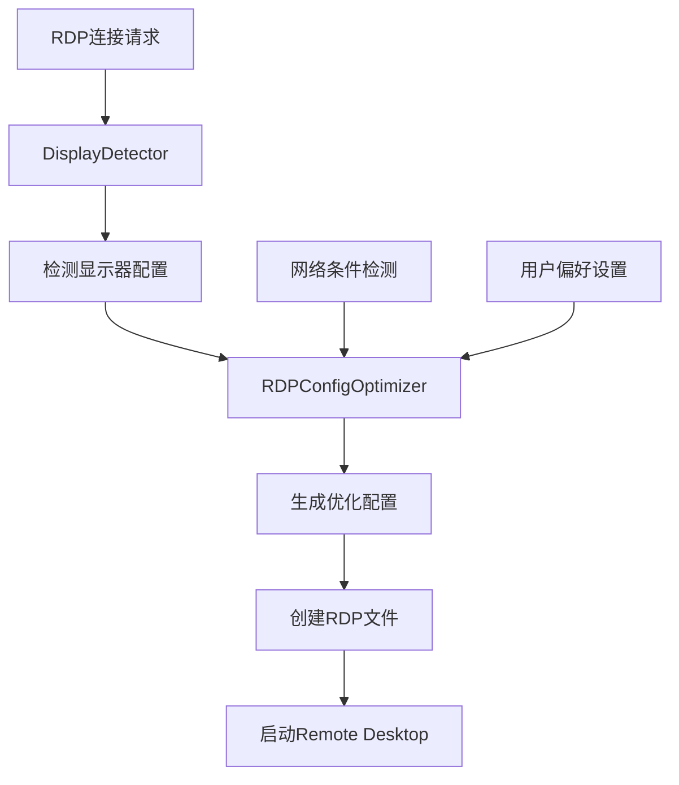

# RDP显示优化问题分析与解决方案

## 问题描述

在使用JMS Protocol Handler连接RDP桌面时，发现显示不够清晰的问题，特别是在以下环境中：
- **HiDPI显示器**（Retina屏幕）
- **多显示器设置**
- **高分辨率显示器**（4K及以上）
- **不同DPI缩放比例**的显示器

## 问题分析

### 1. 当前RDP配置的局限性

当前的RDP配置使用固定参数，未考虑用户的实际显示环境：

```
session bpp:i:32
audiomode:i:0
smart sizing:i:1
screen mode id:i:2
```

### 2. 主要问题点

1. **分辨率不匹配**
   - 使用固定分辨率，未适配用户显示器的原生分辨率
   - 在HiDPI显示器上可能导致模糊或缩放问题

2. **DPI缩放处理不当**
   - 未设置`desktopscalefactor`参数
   - HiDPI显示器的缩放比例未被正确识别和应用

3. **显示质量参数未优化**
   - 压缩设置可能过高，影响图像质量
   - 字体平滑等参数未针对HiDPI优化

4. **多显示器支持不足**
   - 未检测和选择最优的显示器配置
   - 外接显示器的特性未被考虑

## 解决方案

### 1. 显示器检测模块 (DisplayDetector)

**功能特性：**
- 自动检测主显示器和所有显示器配置
- 识别HiDPI（Retina）显示器
- 获取分辨率、缩放因子、颜色深度等参数
- 支持多显示器环境的最优配置选择

**核心实现：**
```swift
struct DisplayConfiguration {
    let width: Int              // 物理分辨率宽度
    let height: Int             // 物理分辨率高度
    let scaleFactor: CGFloat    // DPI缩放因子 (1.0, 2.0等)
    let colorDepth: Int         // 颜色深度
    let refreshRate: Int        // 刷新率
    let isRetina: Bool          // 是否为HiDPI显示器
    let isExternal: Bool        // 是否为外接显示器
}
```

### 2. RDP配置优化器 (RDPConfigOptimizer)

**优化策略：**

#### HiDPI显示器优化
- **分辨率设置**：使用显示器原生分辨率或合理的缩放分辨率
- **DPI缩放**：设置`desktopscalefactor:i:200`（对应200%缩放）
- **字体平滑**：启用`allow font smoothing:i:1`
- **压缩设置**：使用`compression:i:0`（无压缩）获得最佳质量

#### 标准显示器优化
- **分辨率设置**：使用显示器原生分辨率
- **DPI缩放**：设置`desktopscalefactor:i:100`（100%缩放）
- **平衡配置**：在质量和性能间找到平衡

#### 网络条件自适应
- **高速网络**：优先质量，使用无压缩和高分辨率
- **中速网络**：平衡模式，适度压缩
- **低速网络**：优先性能，降低分辨率和启用压缩

### 3. 优化的RDP配置参数

#### 显示相关参数
```
desktopwidth:i:3840                    # 桌面宽度（根据显示器调整）
desktopheight:i:2160                   # 桌面高度（根据显示器调整）
session bpp:i:32                       # 颜色深度（32位真彩色）
desktopscalefactor:i:200               # DPI缩放因子（HiDPI为200%）
smart sizing:i:1                       # 智能调整大小
compression:i:0                        # 压缩级别（0=无压缩）
```

#### 连接优化参数
```
bitmapcachepersistenable:i:1           # 位图缓存持久化
disable wallpaper:i:0                  # 保持壁纸（完整体验）
allow font smoothing:i:1               # 字体平滑（HiDPI优化）
disable full window drag:i:0           # 启用完整窗口拖拽
disable menu anims:i:0                 # 启用菜单动画
disable themes:i:0                     # 启用主题
screen mode id:i:2                     # 全屏模式
connection type:i:6                    # 宽带连接类型
networkautodetect:i:1                  # 网络自动检测
```

### 4. 实现架构



### 5. 配置文件示例

#### HiDPI显示器配置
```
full address:s:server.example.com:3389
username:s:user@domain
desktopwidth:i:3840
desktopheight:i:2160
session bpp:i:32
desktopscalefactor:i:200
smart sizing:i:1
compression:i:0
bitmapcachepersistenable:i:1
disable wallpaper:i:0
allow font smoothing:i:1
screen mode id:i:2
connection type:i:6
networkautodetect:i:1
```

#### 标准显示器配置
```
full address:s:server.example.com:3389
username:s:user@domain
desktopwidth:i:1920
desktopheight:i:1080
session bpp:i:32
desktopscalefactor:i:100
smart sizing:i:1
compression:i:1
bitmapcachepersistenable:i:1
disable wallpaper:i:0
allow font smoothing:i:0
screen mode id:i:2
connection type:i:6
networkautodetect:i:1
```

## 预期效果

### 1. 显示配置改善
- **HiDPI显示器**：文字和图像更加清晰锐利
- **标准显示器**：获得最佳的原生分辨率体验
- **多显示器**：自动选择最优显示器配置

### 2. 用户体验提升
- **自动化配置**：无需手动调整显示参数
- **智能适配**：根据硬件环境自动优化
- **性能平衡**：在质量和性能间找到最佳平衡

### 3. 兼容性增强
- **多种显示器类型**：支持各种分辨率和DPI设置
- **网络环境适应**：根据网络条件自动调整
- **向后兼容**：保持对旧版本Remote Desktop的支持

## 实施计划

1. **第一阶段**：实现DisplayDetector模块
2. **第二阶段**：开发RDPConfigOptimizer
3. **第三阶段**：集成到RemoteDesktopIntegrator
4. **第四阶段**：测试和优化
5. **第五阶段**：文档更新和部署

## 测试验证

### 测试环境
- **MacBook Pro 16" (M4)** - HiDPI内置显示器
- **外接4K显示器** - 标准DPI外接显示器
- **多显示器设置** - 内置+外接显示器组合
- **不同网络环境** - 高速/中速/低速网络

### 验证指标
- **显示清晰度**：文字和图像的锐利程度
- **色彩准确性**：颜色显示的准确性
- **性能表现**：连接速度和响应性
- **用户满意度**：整体使用体验

通过这个全面的显示优化解决方案，JMS Protocol Handler将能够为用户提供在各种显示环境下都清晰、流畅的RDP连接体验。
